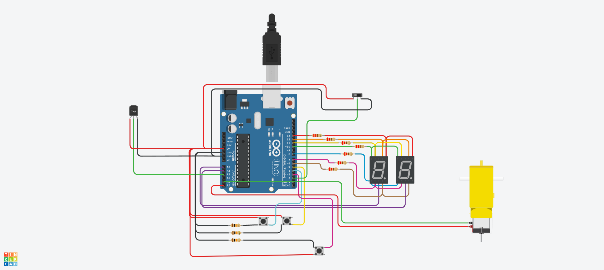
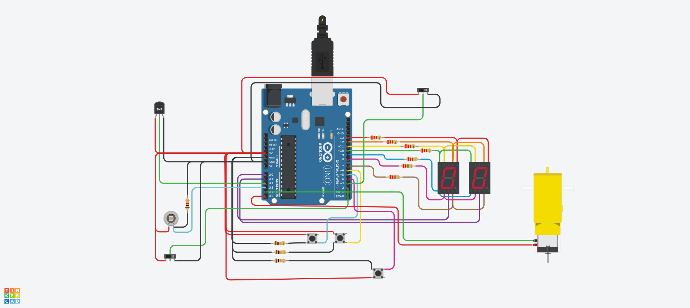

# Parcial SPD 


## Alumno 
- Leandro Gómez Antúnez
- Braian Catriel Gatto
- Rocío Gómez


## Parte 1: Contador de 0 a 99 con Display 7 Segmentos y Multiplexación 


## Descripción
En esta parte del proyecto se diseñó un contador de 0 a 99 utilizando 2 displays de 7 segmentos. El contador utiliza 3 botones para controlar su funcionamiento: 1 para contar de forma creciente, 1 para contar de forma decreciente y 1 para reiniciar la cuenta a 0.  Para optimizar la cantidad de pines de la placa arduino se utilizó la técnica de multiplexación con cátodo común.

## Función principal
Esta parte del código se encarga de sumar, restar o resetear el contador dependiendo del pulsador que accionemos. Se aplicó un pequeño delay utilizando la función millis() para evitar el efecto rebote del pulsador. También hace uso de Serial.print() para controlar que los valores sean los esperados. Una vez determinado el número a mostrar el valor del contador se pasa a la función llamada "alternarLeds()" que se encarga de mostrar en los displays el valor, además de alternar el encendido de cada uno debido al uso de la multiplexación.

```cpp
//Pulsadores--------------------
  	puls_suma = digitalRead(pulsador_suma);  //lectura digital de pin
	puls_resta = digitalRead(pulsador_resta);
  	puls_reset = digitalRead(pulsador_reset);
  
  
  if (puls_suma && (millis()-tiempo > antirrebote)) {
    contador++;
    tiempo = millis();
  	Serial.println(contador);
  }else if (puls_resta && (millis()-tiempo > antirrebote)) {
    contador--;
    tiempo = millis();
  	Serial.println(contador);	
  }else if (puls_reset && (millis()-tiempo > antirrebote)) {
    	contador = 0;
    tiempo = millis();
    Serial.println(contador);
  }
  
  if(contador > 99){
    contador = 0;
  }else if(contador < 0){
    contador = 99;
  }
  
  
  alternarLeds(contador);
```

## :robot: Link al proyecto
- [Parte 1](https://www.tinkercad.com/things/8Xpm7Flfr3n-parcial-domiciliario-spd-parte-1/editel?sharecode=JVViB7MPuhPJMNZZktFDwT3zRe2Ar468ZiNAzWNvGbU)

---

## Parte 2: Modificación con Interruptor Deslizante y Números Primos 



## Descripción
Luego del contador se añadió un interruptor deslizante que permite seleccionar entre dos modos del contador. Hacia la derecha el contador funiciona de la misma manera que en funcionaba en la primera parte, deslizando hacia la izquierda el contador solo mostrará los números que sean primos. Los 3 botones siguen con la función asignada en un principio.

Luego fué agregado un sensor de temperatura que mostrará a través del monitor la temperatura. La razón de no utilizar los displays es que el sensor mide hasta los 125 ºC por lo que era necesario un tercer display. 

## Función primo()
Esta función se encarga de determinar si el numero de contador es un numero primo. La función recibe el valor del contador como parametro. El valor entra en un bucle FOR que evalúa si existe otro valor por el que sea divisible aparte de sí mismo, en ese caso retornará False. Como caso especial el valor 1 lo descarta como primo aunque cumpla las condiciones. Si se completa el bucle la función devuelve True confirmando que es un valor primo.


```cpp
bool primo( int n){
  if (n==1){
  	return(false);
  }else{
  	for ( int i = 2 ; i <n ; i++){
      if (n % i == 0){ 
        return(false);
      }
    }
  }
  return (true);
}
```
## Sensor de temperatura TPM
El sensor de temperatura poseé un rango de medición de -40 grados centígrados a 125 grados centígrados. Los valores de medición sólo se mostrarán en el monitor si este cambia con respecto a la medición anterior para no saturar con el mismo dato en loop.
Primeramente se utilizó la función map() para establecer el rango pero como los valores a ingresar y el resultado de la medición eran inexactos, se recurrió a realizar la conversión utilizando el voltaje y la medición analógica. De este modo los resultados son más exactos.
```cpp
//--------------sensor de temperatura
  int temp_anterior = temperatura;
  //temperatura = map(analogRead(SENSOR_TEMPERATURA),0,1023,-50,450);
  valor = analogRead(SENSOR_TEMPERATURA);
  voltaje = ((valor * 5)/1024);
  temperatura = ((voltaje-0.5)*100);
  

  
  if(abs(temp_anterior - temperatura)> 0.5 ){
    Serial.print("Temperatura: ");
    Serial.print(temperatura);
    Serial.println(" Grados");
  }

```
## Motor de aficionado
Este motor tiene una velocidad de giro bastante alta pero poca fuerza, por eso tiene integrado una serie de engranajes que permiten transformar esa velocidad en torque, de tal manera que pueda mover, por ejemplo, una rueda. Al estar conectado a dos pines de la placa Arduino se puede seleccionar mediante código el sentido de giro.
Cuando el sensor de temperatura llegue a cierto valor. Se podría utilizar este motor para abrir una ventilación que ayude a bajar la temperatura o utilizar el pequeño motor sin los engranajes para hacer girar unas pequeñas aspas.


## :robot: Link al proyecto
- [Parte 2](https://www.tinkercad.com/things/bMhXdcsKlZr-parcial-domiciliario-spd-parte-2/editel?sharecode=QUtv5LL5CogbioIICBzB4xI_E0JsPRDQnt_gh3dl7Ds)

## Parte 3: Fotodiodo con interruptor



## Descripción
En la parte final se añadió un fotodiodo al proyecto. Se buscó no eliminar ninguna de las funcionalidades agregadas hasta ahora, de modo que, aunque no fue solicitado se añadió un interruptor deslizante para que el valor del fotodiodo se despliegue en los dos displays en lugar del contador.

## Función principal del fotodiodo
El fotodiodo es un semiconductor sensible a la luz visible o infrarroja. A medida que sea excitado por la luz se determinara la circulación de corriente. Tiene conectado el negativo a la fuente y el positivo mediante una resistencia de 1k Ohm a GND debido a que tiene polaridad inversa. Del positivo tambien sale la conección hacia la entrada analogica de la placa de arduino.

```cpp
//Fotodiodo
  int luz_anterior = luz;
  luz = map(analogRead(FOTODIODO),1,21,0,99);
```
Luego mediante un IF constatamos que seleccionamos el modo "fotodiodo" y el valor es asignado a la variable contador para economizar código.
```cpp
if(interr_foto==1){
  	contador = luz;
    if(luz_anterior != luz){
    		Serial.print("Luz: ");
    		Serial.println(luz);
    }
  }
```

## :robot: Link al proyecto
- [Parte 3](https://www.tinkercad.com/things/7hlzh9JXNck-parcial-domiciliario-spd-parte-3/editel?sharecode=77mxBGioB1AEDH89ZRqShSS7STHmLXneo2EQxKgaaGM)
